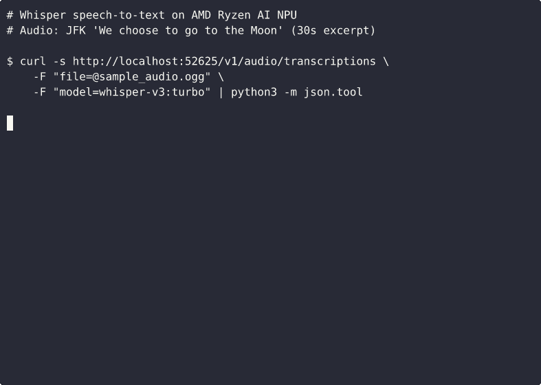

# FastFlowLM Docker — Run LLMs on AMD Ryzen AI NPU (Linux)

> **🤖 This entire project — Dockerfile, README, diagnosis, build process, and
> testing — was generated by [Claude Opus 4.6](https://www.anthropic.com/claude)
> running inside [GitHub Copilot CLI](https://githubnext.com/projects/copilot-cli/).
> A human provided the hardware and the goal ("run an LLM on my NPU"); the AI
> figured out the rest, including discovering that building FastFlowLM from source
> on Linux works despite no official support yet.**

Run large language models on your AMD Ryzen AI NPU under Linux, using
[FastFlowLM](https://github.com/FastFlowLM/FastFlowLM) inside Docker.


## What this is

As of March 2026, running LLMs on AMD's XDNA2 NPU under Linux is not
straightforward. AMD's official Ryzen AI 1.7 stack is missing a critical
shared library (`onnxruntime_providers_ryzenai.so`) on Linux
([amd/RyzenAI-SW#333](https://github.com/amd/RyzenAI-SW/issues/333)),
and FastFlowLM doesn't yet ship Linux binaries in releases
([FastFlowLM#381](https://github.com/FastFlowLM/FastFlowLM/issues/381)).

This Dockerfile builds FastFlowLM from source and packages everything needed
into a minimal container that talks directly to the NPU.

## Supported hardware

Any AMD processor with an XDNA/XDNA2 NPU, including:
- Ryzen AI 9 HX 370/375 (Strix Point — XDNA2)
- Ryzen AI 9 HX 395 (Strix Halo — XDNA2)
- Ryzen AI 7 PRO 360 (NPU4 / AIE2P) — confirmed by community ([#1](https://github.com/hpenedones/fastflowlm-docker/issues/1))
- Ryzen AI Max / Max+ (Kraken Point)
- And other XDNA-based APUs

## Host prerequisites

| Requirement | How to check |
|---|---|
| Linux kernel ≥ 6.11 with `amdxdna` driver | `lsmod \| grep amdxdna` |
| NPU device node | `ls -la /dev/accel/accel0` |
| NPU firmware ≥ 1.1.0.0 | `ls /lib/firmware/amdnpu/` |
| Docker installed | `docker --version` |
| memlock unlimited (recommended) | `ulimit -l` |

### Quick host setup (Ubuntu 24.04)

The container builds XRT from source internally, so you only need the
host-side kernel driver and firmware:

```bash
# Install the amdxdna kernel driver (from AMD's xdna-driver repo or PPA)
# See https://github.com/amd/xdna-driver for full instructions
sudo add-apt-repository ppa:amd-team/xrt
sudo apt update && sudo apt install libxrt-npu2

# Set memlock to unlimited (needs reboot)
echo -e "* soft memlock unlimited\n* hard memlock unlimited" | sudo tee -a /etc/security/limits.conf
sudo reboot
```

> **Note**: If the PPA's XRT doesn't work with your kernel (e.g. kernel 6.17+),
> you may need to build the [xdna-driver](https://github.com/amd/xdna-driver)
> from source on the host. See [Troubleshooting](#troubleshooting) below.

## Build the Docker image

```bash
git clone https://github.com/hpenedones/fastflowlm-docker.git
cd fastflowlm-docker
docker build -t fastflowlm .
```

The main image now pins FastFlowLM to commit
`5b33fd97afc4d07a5673fff0efdec4e15fe61a1e` for reproducibility.
If you also want the public GGUF -> Q4NX conversion tool for local experiments,
build the optional helper image:

```bash
docker build -f Dockerfile.q4nx-converter -t fastflowlm-q4nx .
```

The build takes ~15-25 minutes (XRT source build + Rust compilation + FLM C++ build).
The resulting image is ~440MB (3-stage build, runtime-only).

## Usage

```bash
# List available NPU models
docker run --rm fastflowlm list

# Download a model (mount cache so it persists)
docker run --rm -v ~/.config/flm:/root/.config/flm fastflowlm pull llama3.2:1b

# Chat with the model on your NPU
docker run -it --rm \
  --device=/dev/accel/accel0 \
  --ulimit memlock=-1:-1 \
  -v ~/.config/flm:/root/.config/flm \
  fastflowlm run llama3.2:1b

# Validate NPU setup
docker run --rm \
  --device=/dev/accel/accel0 \
  --ulimit memlock=-1:-1 \
  fastflowlm validate

# Run OpenAI-compatible API server on port 8000
docker run -d --rm \
  --device=/dev/accel/accel0 \
  --ulimit memlock=-1:-1 \
  -v ~/.config/flm:/root/.config/flm \
  -p 8000:8000 \
  fastflowlm serve
```

## Benchmarks

Measured on an **AMD Ryzen AI 9 HX 370** (Strix Point) with 32GB LPDDR5x,
Ubuntu 24.04, kernel 6.17, FLM v0.9.35, power mode: `performance`.

Prompt: *"Explain quantum computing in 200 words."*

| Model | Params | TTFT | Prefill | Decode | Tokens |
|---|---|---|---|---|---|
| Qwen3 0.6B | 0.6B | 535 ms | 52.4 tok/s | **88.7 tok/s** | 161 |
| LFM2 1.2B | 1.2B | 363 ms | 49.6 tok/s | **62.9 tok/s** | 240 |
| Llama 3.2 1B | 1B | 460 ms | 95.9 tok/s | **60.1 tok/s** | 271 |
| Qwen3 1.7B | 1.7B | 640 ms | 37.5 tok/s | **40.4 tok/s** | 434 |
| Gemma3 1B | 1B | 550 ms | 34.6 tok/s | **37.9 tok/s** | 201 |
| Llama 3.2 3B | 3B | 957 ms | 46.0 tok/s | **24.4 tok/s** | 294 |
| Phi-4 Mini 4B | 4B | 926 ms | 11.9 tok/s | **20.0 tok/s** | 935 |
| Qwen3 4B | 4B | 1040 ms | 23.1 tok/s | **18.7 tok/s** | 551 |

- **TTFT** = Time To First Token (lower is better)
- **Prefill** = prompt processing speed
- **Decode** = token generation speed (the number you feel when chatting)
- **Tokens** = total tokens generated in the response

All inference runs entirely on the NPU — zero GPU or CPU compute for the
model forward pass. The Qwen3 0.6B and Llama 3.2 1B models are the sweet
spot for interactive use, delivering 60-89 tokens/s decode speed.

## Available models

The Dockerfile now pins FastFlowLM to commit
`5b33fd97afc4d07a5673fff0efdec4e15fe61a1e` for reproducible builds.
The exact upstream list can change over time, so `docker run --rm fastflowlm list`
is authoritative. As of that pinned commit, these **selected** model tags are
known to be available:

| Model | Size | Command |
|---|---|---|
| Llama 3.2 1B | ~1.2 GB | `run llama3.2:1b` |
| Llama 3.2 3B | ~1.8 GB | `run llama3.2:3b` |
| Llama 3.1 8B | ~4.5 GB | `run llama3.1:8b` |
| Qwen3 0.6B | ~0.4 GB | `run qwen3:0.6b` |
| Qwen3 1.7B | ~1.0 GB | `run qwen3:1.7b` |
| Qwen3 4B | ~2.3 GB | `run qwen3:4b` |
| Qwen3 8B | ~5.6 GB | `run qwen3:8b` |
| Qwen3 4B Thinking 2507 | ~3.1 GB | `run qwen3-tk:4b` |
| Qwen3 4B Instruct 2507 | ~3.1 GB | `run qwen3-it:4b` |
| Qwen3-VL 4B Instruct | ~3.9 GB | `run qwen3vl-it:4b` |
| Gemma3 1B | ~0.7 GB | `run gemma3:1b` |
| DeepSeek-R1 8B | ~4.5 GB | `run deepseek-r1:8b` |
| Phi-4 Mini 4B | ~2.3 GB | `run phi4-mini-it:4b` |
| Whisper V3 Turbo | ~0.6 GB | `serve --asr 1` (see [Whisper section](#speech-to-text-with-whisper)) |

Run `flm list` for the complete list.

`Qwen3.5-35B-A3B` is **not** currently in the upstream FastFlowLM model list.

## Qwen3.5-35B-A3B status

Today, FastFlowLM still cannot run `Qwen3.5-35B-A3B` on Ryzen AI just by
quantizing or converting the weights.

Why this is still blocked:

- The pinned upstream `model_list.json` does **not** contain `Qwen3.5-35B-A3B`.
- The public [`FLM_Q4NX_Converter`](https://github.com/FastFlowLM/FLM_Q4NX_Converter)
  currently targets architectures such as `Qwen2`, `Qwen2.5`, `Qwen3`,
  `Qwen3-VL`, `Llama`, `Gemma3`, `Phi4`, `GPT-OSS`, and `LFM2` — not
  `Qwen3.5-35B-A3B`.
- FastFlowLM contributors have stated that models not already in `flm list`
  are not supported yet because new model sizes need different `xclbin` and code
  setup, especially at decode time.
- Even if a low-bit conversion existed, `Qwen3.5-35B-A3B` still carries the full
  35B-parameter weight set in memory/storage: expect roughly **~21 GB at INT4**
  and **~36-40 GB at INT8** before KV-cache and runtime overhead.

What this repo can do today:

- pin FastFlowLM to a known-good upstream commit
- build the public GGUF -> Q4NX converter in a separate helper image
- generate local `model_list.json` overlays for **already supported**
  FastFlowLM families/sizes so you can test local `.q4nx` artifacts cleanly

What this repo cannot do today:

- make FastFlowLM run a brand-new `35B-A3B` tag just by editing JSON or reducing
  precision

## Experimental local Q4NX workflow

This repo now includes an **optional** conversion path for local experiments with
families and sizes that FastFlowLM already knows how to execute.

### 1. Build the converter image

```bash
docker build -f Dockerfile.q4nx-converter -t fastflowlm-q4nx .
```

### 2. Convert a compatible GGUF model to Q4NX

This step is useful for models that stay within an already supported FastFlowLM
family/size (for example, a custom or fine-tuned `qwen3:8b` variant).

```bash
docker run --rm -v "$PWD:/work" fastflowlm-q4nx \
  -i /work/Qwen3-8B-Q4_1.gguf \
  -o /work/qwen3-8b-local
```

The converter writes `model.q4nx` into the output folder. For VLMs, it may also
produce `vision_weight.q4nx`.

### 3. Extract the pinned FastFlowLM model list

```bash
./scripts/extract_flm_model_list.sh fastflowlm ~/.config/flm/model_list.base.json
```

### 4. Create a local model-list overlay entry

```bash
python3 scripts/register_flm_local_model.py \
  --base ~/.config/flm/model_list.base.json \
  --output ~/.config/flm/model_list.local.json \
  --template-tag qwen3:8b \
  --new-tag qwen3-local:8b \
  --name Qwen3-8B-Local-NPU2 \
  --family qwen3 \
  --parameter-size 8B \
  --size-bytes 8000000000 \
  --default-context-length 16384 \
  --mkdir
```

This prints the expected local model directory. For the example above, it will be
something like:

```text
~/.config/flm/models/Qwen3-8B-Local-NPU2
```

Copy the required files there. At minimum that usually means:

- `config.json`
- `model.q4nx`
- `tokenizer.json`
- `tokenizer_config.json`

Use the file list printed by the helper script for the exact template you chose.

### 5. Run FastFlowLM with the local overlay

```bash
docker run -it --rm \
  --device=/dev/accel/accel0 \
  --ulimit memlock=-1:-1 \
  -e FLM_CONFIG_PATH=/root/.config/flm/model_list.local.json \
  -v ~/.config/flm:/root/.config/flm \
  fastflowlm run qwen3-local:8b
```

Notes:

- Local overlay entries are **manual-copy only** by default. The helper script
  intentionally disables `flm pull` for those entries unless you provide real
  remote URLs.
- This workflow is for models that stay within FastFlowLM's existing runtime
  envelope. It is useful for swapping weights or testing same-family/same-size
  local conversions.
- It does **not** unlock `Qwen3.5-35B-A3B` yet. We still need upstream runtime,
  `xclbin`, and registry support for that model size/family.

## Speech-to-text with Whisper

FastFlowLM also supports **Whisper V3 Turbo** for NPU-accelerated speech recognition.
Whisper is not an LLM — it uses the `--asr` flag instead of being run directly.



A [30-second sample](sample_audio.ogg) of JFK's 1962 Rice University "We choose to
go to the Moon" speech is included in this repo (source:
[Wikimedia Commons](https://commons.wikimedia.org/wiki/File:Jfk_rice_university_we_choose_to_go_to_the_moon.ogg),
public domain, trimmed to 30s at the 9-minute mark).

### API server mode

```bash
# Start the server with Whisper (+ an LLM for multimodal use)
docker run -d --rm \
  --device=/dev/accel/accel0 \
  --ulimit memlock=-1:-1 \
  -v ~/.config/flm:/root/.config/flm \
  -p 52625:52625 \
  fastflowlm serve gemma3:1b --asr 1

# Transcribe an audio file (OpenAI-compatible API)
curl -s http://localhost:52625/v1/audio/transcriptions \
  -F "file=@sample_audio.ogg" \
  -F "model=whisper-v3:turbo" | python3 -m json.tool
```

Supported audio formats: `.wav`, `.mp3`, `.ogg`, `.m4a`, `.flac` — anything FFmpeg can decode.

On a Ryzen AI 9 HX 370, a 30-second clip transcribes in ~5 seconds; the full
17-minute speech transcribes in ~2.5 minutes — all on the NPU.

### Interactive CLI mode

```bash
# Start a chat session with Whisper enabled
docker run -it --rm \
  --device=/dev/accel/accel0 \
  --ulimit memlock=-1:-1 \
  -v ~/.config/flm:/root/.config/flm \
  fastflowlm run gemma3:1b --asr 1
```

Then inside the chat, use `/input "path/to/audio.mp3" summarize it` to transcribe
and discuss audio files with the LLM.

## How it works

The main Dockerfile uses a 3-stage build:
1. **XRT builder**: Builds XRT base and NPU plugin from the
    [xdna-driver](https://github.com/amd/xdna-driver) source (no PPA dependency)
2. **FLM builder**: Installs build dependencies (cmake, ninja, Rust, Boost,
   FFmpeg, FFTW3), clones a **pinned FastFlowLM commit**, and compiles against
   the source-built XRT
3. **Runtime stage**: Copies only the built binary, NPU kernel libraries (`.so`),
   and xclbin files into a minimal Ubuntu image with runtime dependencies

There is also an optional `Dockerfile.q4nx-converter` that builds FastFlowLM's
public GGUF -> Q4NX converter for local experiments with already supported
model families/sizes.

The container accesses the NPU via `--device=/dev/accel/accel0`. The host
kernel's `amdxdna` driver handles the actual hardware communication.

## Troubleshooting

**`flm validate` shows no NPU**: Make sure you passed `--device=/dev/accel/accel0`
and the host has the `amdxdna` driver loaded.

**Permission denied on /dev/accel/accel0**: Check device permissions on the host
(`ls -la /dev/accel/accel0`). You may need to add your user to the `render` group
or run the container with `--group-add render`.

**Low memlock limit**: The NPU needs a high memlock limit. Pass `--ulimit memlock=-1:-1`
to Docker, or set unlimited memlock in `/etc/security/limits.conf` on the host and reboot.

**XRT version mismatch on the host**: The PPA's XRT (2.20.0) may not work with
newer kernels (6.17+). If `amdxdna` fails to load, build the
[xdna-driver](https://github.com/amd/xdna-driver) from source on the host.
Note: the Docker image already builds XRT from source internally, so this only
affects the host-side kernel driver.

**NPU4 / AIE2P firmware (e.g. Ryzen AI 7 PRO 360)**: Kernel 6.17 may require
protocol-specific firmware under `/usr/lib/firmware/amdnpu/17f0_10/`. If `flm validate`
fails, check that the firmware files are present and symlinked correctly — see
[issue #1](https://github.com/hpenedones/fastflowlm-docker/issues/1) for a detailed
walkthrough.

## Credits

- [FastFlowLM](https://github.com/FastFlowLM/FastFlowLM) — the NPU LLM runtime
- [AMD XDNA Driver](https://github.com/amd/xdna-driver) — Linux NPU driver and XRT

## License

The Dockerfile itself is MIT licensed. FastFlowLM and AMD's libraries have their
own licenses — see their respective repositories.
